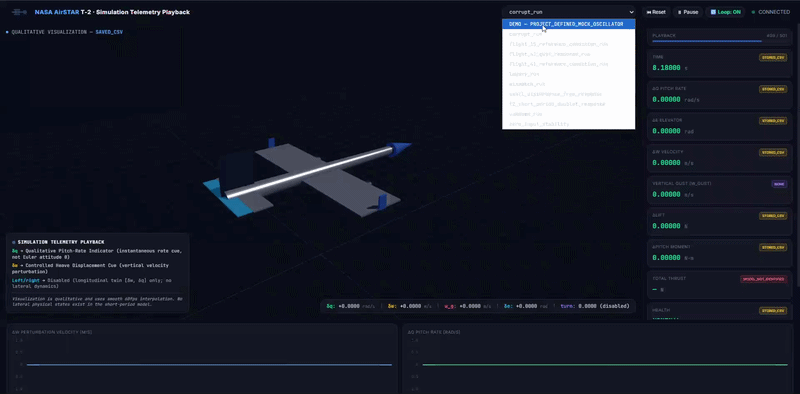
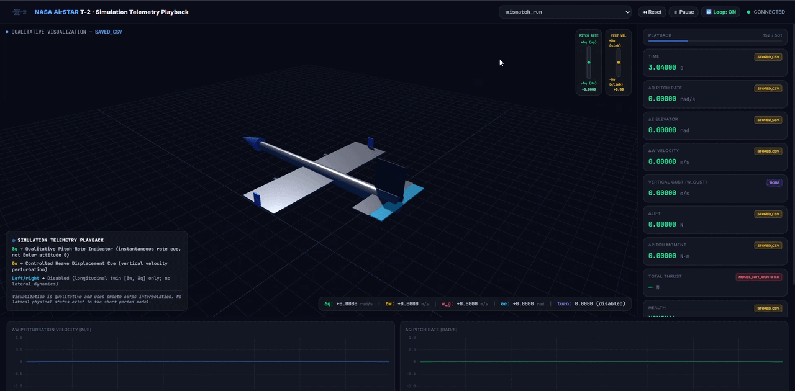

# NASA AirSTAR T-2 Digital Twin

> **Reduced-order digital twin of the NASA AirSTAR T-2 integrating longitudinal aerodynamics, short-period flight dynamics, project-defined gust response, telemetry, state estimation, health monitoring, and dashboard playback.**


*Recorded project demonstration. This visualization is project-defined and is not a reproduction of NASA flight-test data.*

## Overview

This project is an engineering simulation and post-processing environment built around the **NASA Airborne Subscale Transport Aircraft Research (AirSTAR) 5.5% Generic Transport Model (GTM), T-2 configuration**.

The current implementation focuses on a **reduced-order longitudinal short-period model** with the state:

```text
x = [δw, δq]ᵀ
```

where:

- `δw` = perturbation body-axis vertical velocity
- `δq` = perturbation pitch rate

The project combines NASA-referenced configuration and flight-condition data with project-defined and project-derived components for simulation, disturbance analysis, telemetry, estimation, diagnostics, and visualization.

## Reference Aircraft

The reference platform is the **NASA AirSTAR T-2**, a 5.5% dynamically scaled Generic Transport Model. The active aircraft configuration is identified in `config.yaml` as:

```text
NASA_T2_NOMINAL_2017
```

The configuration keeps the active physical baseline separate from flight-specific aerodynamic reference cases and preserves source provenance.

## Core Architecture

```text
Configuration / reference data
            │
            ▼
      Aircraft + Atmosphere
            │
            ▼
        Aerodynamics
            │
            ▼
    Dimensional conversion
            │
            ▼
    Short-period dynamics
            │
            ▼
          RK4
            │
            ▼
      Simulation telemetry
            │
      ┌─────┴──────┐
      ▼            ▼
 Sensor model    Diagnostics
      │
      ▼
 State estimator
      │
      ▼
 Health monitor

Simulation telemetry ─────────► Dashboard / Playback
```

The basic `main.py` simulation path runs the scenario and simulator and saves telemetry. Sensor modelling, state estimation, and health monitoring are provided as downstream project layers through `digital_twin/integration.py`.

## Key Components

### Aerodynamics

The aerodynamic model uses identified **longitudinal perturbation derivatives** for the short-period approximation. It computes changes associated with:

- angle-of-attack perturbation
- pitch-rate perturbation
- elevator deflection

The dimensional stability derivatives used by the short-period dynamics are explicitly treated as **project-derived** quantities rather than direct NASA measurements.

### Flight Dynamics

The current equations represent only the **longitudinal short-period mode** using:

```text
δw  → body-axis vertical-velocity perturbation
δq  → pitch-rate perturbation
```

The model produces instantaneous state derivatives, while `simulation/simulator.py` performs the numerical integration using **fourth-order Runge-Kutta (RK4)**.

### Gust Response

The project includes a **Project-Defined Longitudinal 1-Cosine Gust**. It is a deterministic discrete gust input, not a stochastic continuous-turbulence model.

The gust modifies the aerodynamic relative vertical-velocity perturbation:

```text
δw_aero = δw − w_gust
```

and is applied inside the reduced-order dynamics rather than being generated only by the dashboard.

### Propulsion

The T-2 configuration represents two JetCat P70 turbine engines.

The NASA-referenced `16 lbf per engine` value is retained as a **rated/headline reference value**, not as a constant flight thrust value. An identified T-2 thrust model is not currently supplied, so propulsion can report:

```text
MODEL_NOT_IDENTIFIED
```

This represents a modelling limitation, not an engine failure.

### Sensor Model

A project-defined sensor noise/bias layer can generate simulated measurements from the model truth state. Its numerical noise and bias values are project-defined placeholders rather than NASA-verified T-2 instrumentation specifications.

### State Estimation

The project provides a **project-defined two-state linear discrete Kalman filter** operating on:

```text
x = [δw, δq]ᵀ
```

This is not an implementation of the NASA filter-error parameter-estimation method described in AIAA 2015-2704.

### Health Monitoring

A project-defined rule-based diagnostic layer evaluates estimated states, residuals, covariance information, and available system-status information. It is observational only and does not feed automatic corrections back into the simulator.

### Dashboard

The dashboard is a **read-only telemetry visualization and playback layer**. It loads saved simulation results, exposes telemetry through the dashboard backend, and provides browser-based playback.

The current dashboard page uses external CDN resources for **Tailwind CSS, Chart.js, and Three.js**.

## Demonstration Records

The repository may contain recorded demonstrations under:

```text
records/
├── all_around.*
├── demo_project.*
├── flight_41_gust_response_run.*
├── instability_response_run.*
├── small_disturbance_free_response.*
└── t2_short_period_doublet_response.*
```

Important dynamic demonstrations include:

| Record | Purpose |
|---|---|
| `small_disturbance_free_response` | Demonstrates the natural response to a project-defined initial perturbation |
| `flight_41_gust_response_run` | Demonstrates the response to the project-defined longitudinal 1-cosine gust |
| `instability_response_run` | Recorded project demonstration of an oscillatory/unstable response; its reproducibility depends on the current scenario source |
| `t2_short_period_doublet_response` | Recorded demonstration associated with the project’s standalone elevator-doublet example |

The Flight 15 and Flight 41 reference-condition scenarios are **reference-condition checks**, not reproductions of their actual NASA flight-test control histories.

## Recorded Demonstrations

The `records/` directory contains GIF recordings that demonstrate different operating cases and the corresponding Digital Twin response.

### 1. Overall Dashboard Demonstration


`all_around.gif` shows the overall dashboard view and how simulation telemetry is presented through the Digital Twin interface.

### 2. Complete Project Demonstration



`demo_project.gif` provides a general demonstration of the project workflow and dashboard response.

### 3. Flight 41 Gust Response


`flight_41_gust_response_run.gif` demonstrates the response of the reduced-order longitudinal model to the **project-defined 1-cosine longitudinal gust**. The gust acts through the aerodynamic relative vertical-velocity perturbation and produces a time-varying short-period response.

### 4. Instability Response


`instability_response_run.gif` is a **project-defined demonstration** of an oscillatory/unstable response. It is intended to show how the Digital Twin behaves when the selected simulation case produces a growing or sustained dynamic response. It is not presented as measured NASA T-2 flight behaviour.

### 5. Small-Disturbance Free Response



`small_disturbance_free_response.gif` demonstrates the natural short-period response from a project-defined initial perturbation with zero control input. This case is useful for observing the model's unforced dynamic behaviour.

### 6. Short-Period Doublet Response


`t2_short_period_doublet_response.gif` demonstrates the response to the project's elevator doublet input. It is a project-defined demonstration of how an elevator excitation produces changes in the simulated short-period states.

> **Important:** These GIFs are visual demonstrations of the current project implementation. They do not constitute reproductions of the original NASA AirSTAR flight-test recordings. The current physical model remains a reduced-order longitudinal system with state `[δw, δq]`.

## NASA Data vs Project-Defined Data

The project maintains an explicit provenance distinction:

| Category | Meaning |
|---|---|
| `NASA_VERIFIED` / `NASA_VERIFIED_REFERENCE_CONDITION` | Values or reference conditions documented in NASA/AIAA sources |
| `PROJECT_DEFINED` | Inputs or behaviours chosen specifically for this project |
| `PROJECT_DERIVED` | Quantities calculated from sourced data using documented assumptions |
| `TEST_ONLY` | Synthetic software-test or demonstration inputs |

Public sources provide reference flight conditions and maneuver characteristics, but the supplied research record does not provide the exact Flight 41/15 control histories or all detailed excitation parameters. Those unavailable elements are therefore not presented as exact NASA flight reproductions.

## Project Structure

```text
aerospace_digital_twin/
│
├── README.md
├── requirements.txt
├── config.yaml
├── main.py
│
├── models/
│   ├── aircraft.py
│   ├── atmosphere.py
│   ├── aerodynamics.py
│   ├── conversion.py
│   ├── flight_dynamics.py
│   ├── propulsion.py
│   └── turbulence.py
│
├── simulation/
│   ├── simulator.py
│   └── scenarios.py
│
├── sensors/
│   └── sensor_model.py
│
├── digital_twin/
│   ├── estimator.py
│   ├── health_monitor.py
│   └── integration.py
│
├── dashboard/
│   ├── app.py
│   └── dashboard.html
│
├── records/
│   └── recorded demonstrations
│
├── data/
│   └── processed/
│
├── scripts/
│   └── validate_short_period.py
│
└── tests/
```

## Installation

```bash
git clone https://github.com/YOUR_USERNAME/nasa-airstar-t2-digital-twin.git
cd nasa-airstar-t2-digital-twin
pip install -r requirements.txt
```

The supplied dependency file currently requires:

```text
PyYAML
pytest
```

## Running the Simulation

Run a registered scenario with:

```bash
python main.py --scenario <scenario_name>
```

Example:

```bash
python main.py --scenario flight_41_gust_response_run
```

Another dynamic example:

```bash
python main.py --scenario small_disturbance_free_response
```

Simulation results are written to:

```text
data/processed/
```

with scenario metadata when generated by the current simulator interface.

## Launching the Dashboard

From the project root:

```bash
python dashboard/app.py --host 127.0.0.1 --port 8000
```

Then open:

```text
http://127.0.0.1:8000
```

The dashboard visualizes saved telemetry and does not execute the aircraft simulation itself.

## Testing

Run the test suite with:

```bash
python -m pytest tests/ -q
```

The project includes tests covering model behaviour, scenario handling, simulation, telemetry contracts, provenance protections, integration, and dashboard behaviour.

## Important Implementation Notes

The current `Simulator` uses the selected flight-condition record's reference mass and pitch inertia for the reduced-order integration. The `Aircraft` object is retained for the project architecture but is not currently coupled into the short-period state integration.

Aerodynamic force/moment and propulsion outputs are recorded as diagnostics; they do not independently replace the conversion-to-derivatives and `flight_dynamics.py` path that drives the two-state evolution.

The dashboard's aircraft movement is a **qualitative visualization cue** derived from available telemetry. It is not an additional physical position or attitude state.

## Current Scope and Limitations

### Reduced-order model

The current aircraft dynamics are limited to:

```text
[δw, δq]
```

This is **not a full 6-DOF aircraft model**.

### No physical lateral-directional dynamics

The current simulator does not model lateral-directional states such as:

```text
δv, β, p, r, φ, ψ
```

and does not contain the corresponding lateral aerodynamic derivatives.

Therefore, **physical left/right aircraft motion during turbulence is not currently simulated**. Cosmetic lateral movement must not be interpreted as simulated lateral dynamics.

### Propulsion limitation

An identified T-2 thrust map/model is not currently provided. `MODEL_NOT_IDENTIFIED` denotes this modelling limitation and does not indicate an engine fault.

### Estimation and health monitoring

The estimator and health monitor are downstream diagnostic layers. They do not automatically modify the simulation state or perform closed-loop control.

### Flight-test reproduction

The project does not claim to reproduce actual NASA AirSTAR flight-test time histories. NASA-referenced data is used where available, while missing control histories and other unavailable parameters remain explicitly project-defined.

## References

1. **Grauer, J. A. & Morelli, E. A. (2015).** *A New Formulation of the Filter-Error Method for Aerodynamic Parameter Estimation in Turbulence.* AIAA 2015-2704.
2. **Grauer, J. A. & Boucher, M. J. (2020).** *Aircraft System Identification from Multisine Inputs and Frequency Responses.* AIAA 2020-2704.
3. **Grauer, J. A. (2017).** *Position Corrections for Airspeed and Flow Angle Measurements on Fixed-Wing Aircraft.* NASA/TM-2017-219795.
4. **Morelli, E. A. (2011).** *Flight Test Maneuvers for Efficient Aerodynamic Modeling.* AIAA 2011-6634.

## Project Status

**Current focus:** reduced-order T-2 longitudinal simulation, project-defined gust-response analysis, telemetry generation, recorded instability demonstration, and engineering dashboard playback.

**Future extension:** lateral-directional dynamics and physically simulated lateral turbulence response, subject to an appropriate set of verified/reference aerodynamic data.
