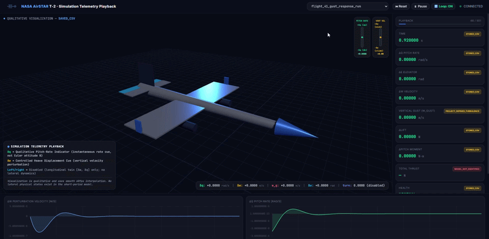

# NASA AirSTAR T-2 Digital Twin

> A rigorous reduced-order digital twin of NASA's 5.5% Generic Transport Model (GTM) T-2 research aircraft. Simulates longitudinal short-period flight dynamics, discrete vertical gusts, synthetic sensor noise, linear Kalman state estimation, rule-based health diagnostics, and real-time browser playback.

<div align="center">
  
  <p><em>Real-time Three.js attitude visualization, Chart.js telemetry strip charts, and state estimation playback.</em></p>
</div>

---

## What This Project Actually Is

Physics first. No hand-waving.

This codebase is an aerospace simulation and telemetry replay environment built around NASA Langley's **Airborne Subscale Transport Aircraft Research (AirSTAR)** program. AirSTAR flew a 5.5% dynamically scaled jet transport known as the **Generic Transport Model (GTM)**, specifically in the twin-turbine **T-2** airframe configuration. NASA used this subscale drone to fly radical, high-risk maneuvers—deep stalls, upset recoveries, extreme turbulence encounters—that would kill human test pilots in a full-sized airliner.

This repository doesn't pretend to be a bloated 6-DOF game simulator. It models something much more focused: an isolated **longitudinal short-period perturbation digital twin**. 

When a jet punches through a sudden updraft or takes a sharp jab of elevator trim, it bobs and pitches rapidly long before its forward speed has time to change. That snappy pitching-and-heaving motion is the short-period mode. We capture it using a two-dimensional state vector:

$$x = \begin{bmatrix} \delta w \\ \delta q \end{bmatrix}$$

* $\delta w$ is the vertical perturbation velocity along the aircraft body Z-axis (positive downwards, in meters per second).
* $\delta q$ is the pitch rate perturbation (pitching nose-up, in radians per second).

Around this core dynamic model, the codebase wraps a complete digital twin stack: atmospheric modeling, dimensional derivative conversion, Runge-Kutta 4th order (RK4) numerical integration, synthetic sensor corruption, a discrete linear Kalman filter, automated health monitoring, and a local web dashboard powered by Three.js and Chart.js.

---

## Architectural Pipeline

Here is how data flows through the system, from the configuration file down to the browser pixels:

```
[ config.yaml ] ──────────────────────────────────────────────┐
       │                                                      │
       ▼                                                      ▼
[ models/aircraft.py ] & [ models/atmosphere.py ]    [ models/propulsion.py ]
       │                                                      │
       ▼                                                      │
[ models/aerodynamics.py ]                                    │
       │ (nondimensional CL, Cm derivatives)                  │
       ▼                                                      │
[ models/conversion.py ]                                      │
       │ (synthesized dimensional Zw, Mw, Zq, Mq derivatives) │
       ▼                                                      │
[ models/flight_dynamics.py ] ◄── [ models/turbulence.py ]     │
       │ (state derivatives dx/dt)        (1-cosine gust)     │
       ▼                                                      │
[ simulation/simulator.py ] ◄─────────────────────────────────┘
       │ (RK4 integration loop + diagnostic thrust/forces)
       ▼
 [ Telemetry CSV History ] (data/processed/)
       │
       ├─────────────────────────────────────────┐
       ▼                                         ▼
[ sensors/sensor_model.py ]              [ dashboard/app.py ]
       │ (adds bias + Gaussian noise)            │ (HTTP & JSON API)
       ▼                                         ▼
[ digital_twin/estimator.py ]            [ dashboard/dashboard.html ]
       │ (2-state Kalman filter x_hat)          (3D plane + live strip charts)
       ▼
[ digital_twin/health_monitor.py ]
       │ (residual & covariance anomaly flags)
       ▼
[ digital_twin/integration.py ]
  (end-to-end twin pipeline)
```

---

## Flight Demonstrations & Response Physics

Every demonstration file in the `records/` folder captures a distinct operating condition of the digital twin. Below is the breakdown of what each recording states, how the physics engine synthesizes that exact dynamic response, and where the underlying numbers originated.

---

### 1. Complete Digital Twin Walkthrough (`demo_project.gif`)

<div align="center">
  
</div>

* **What It States:**  
  Walks through the entire end-to-end digital twin execution pipeline. Shows how the simulator initializes nominal aircraft geometry, steps through numerical integration, serializes 15 channels of telemetry to disk, streams frames over the Python HTTP API, and renders real-time 3D flight cues alongside live synchronized strip charts.
* **How the Response Is Generated:**
  1. The scenario runner loads the verified T-2 mass properties ($m = 23.92\text{ kg}$, $I_{yy} = 6.306\text{ kg}\cdot\text{m}^2$) and Flight 41 aerodynamic derivatives from `config.yaml`.
  2. The simulation advances via 4th-order Runge-Kutta integration at a fixed timestep of $\Delta t = 0.02\text{ s}$ ($50\text{ Hz}$).
  3. `sensors/sensor_model.py` corrupts the clean truth states with additive Gaussian white noise and static biases.
  4. `digital_twin/estimator.py` runs a 2-state discrete Kalman filter to estimate $\hat{x} = [\delta\hat{w}, \delta\hat{q}]^T$ from the noisy sensor vector.
  5. `digital_twin/health_monitor.py` inspects covariance bounds and innovation residuals on every frame.
  6. `dashboard/app.py` streams the resulting telemetry frames to `dashboard.html` over a thread-safe 50 ms polling loop. Three.js binds the aircraft attitude matrix to pitch rate $\delta q$, while Chart.js updates rolling acceleration and velocity strip charts.
* **Source Provenance:**  
  Accumulates the entire system stack: AIAA 2015-2704 (Flight 41 baseline and derivative estimates), NASA/TM-2017-219795 (airframe dimensions), and standard ISA atmospheric conditions.

---

### 2. Flight 41 Vertical Gust Response (`flight_41_gust_response.gif`)

<div align="center">
  
</div>

* **What It States:**  
  Demonstrates how the T-2 GTM responds when penetrating a sharp vertical updraft (a 1-cosine gust). Shows the rapid upward heave acceleration ($a_z$), followed by an immediate nose-down pitching moment that stabilizes the airframe back toward trim.
* **How the Response Is Generated:**
  1. The aircraft trims at $V = 139.1\text{ ft/s}$ ($42.4\text{ m/s}$), $\alpha = 4.077^\circ$, and $h = 1227\text{ ft}$ ($374\text{ m}$).
  2. `models/turbulence.py` injects a deterministic 1-cosine vertical gust $w_{gust}(t)$ directly into the relative aerodynamic velocity:
     $$\delta w_{aero}(t) = \delta w(t) - w_{gust}(t)$$
  3. The sudden relative airflow produces an immediate effective angle-of-attack spike ($\Delta\alpha \approx \delta w_{aero} / U_e$).
  4. The dimensional lift derivative $Z_w$ forces an upward acceleration ($-\dot{w}$ in body axes), while the static pitch stability derivative $M_w$ ($C_{m_\alpha} = -1.667$) drives a powerful restoring nose-down pitching moment ($\dot{q} < 0$).
  5. Pitch damping derivative $M_q$ ($C_{m_q} = -46.36$) dissipates the oscillation within 2 to 3 cycles without pilot elevator intervention ($\delta e = 0$).
* **Source Provenance:**  
  Flight condition and identified aerodynamic derivatives sourced directly from **AIAA 2015-2704**, Section VI.A, Table 2 & Table 3. Gust profile is a project-defined standard 1-cosine discrete gust formulation.

---

### 3. Small-Disturbance Free Response (`small_disturbance_free_response.gif`)

<div align="center">
  
</div>

* **What It States:**  
  Shows the natural unforced stability of the T-2 airframe. Released from an initial pitch-rate and heave offset with zero elevator deflection, the aircraft smoothly damps out the disturbance and returns to steady-state flight.
* **How the Response Is Generated:**
  1. Initial state vector is offset at $t = 0$:
     $$x(0) = \begin{bmatrix} \delta w_0 \\ \delta q_0 \end{bmatrix} = \begin{bmatrix} 1.0\text{ m/s} \\ 0.01\text{ rad/s} \end{bmatrix}$$
  2. Elevator control input is locked at zero ($\delta e(t) = 0$).
  3. The unforced state-space equation governs the motion:
     $$\dot{x} = A' x$$
  4. The short-period plant matrix $A'$ possesses a pair of stable complex-conjugate eigenvalues with negative real parts:
     $$\lambda_{1,2} = -\zeta \omega_n \pm j \omega_n \sqrt{1 - \zeta^2}$$
  5. The RK4 integrator marches forward; pitch rate $\delta q$ and vertical velocity $\delta w$ decay exponentially, illustrating classic damped oscillatory flight mechanics.
* **Source Provenance:**  
  Dimensional derivatives derived from **AIAA 2015-2704** Table 3 (Flight 41). Initial perturbation offsets are software test parameters designed to isolate the homogeneous short-period eigenvalues.

---

### 4. Dynamic Instability & Fault Diagnostic Response (`instability_response.gif`)

<div align="center">
  
  <p><em>Also available as a full recording: <a href="records/instability_response.mp4">records/instability_response.mp4</a></em></p>
</div>

* **What It States:**  
  Demonstrates an oscillatory diverging flight condition where aerodynamic damping is degraded or destabilizing control derivatives are introduced. Illustrates how the digital twin's health monitoring layer detects envelope excursions and flags subsystem anomalies.
* **How the Response Is Generated:**
  1. The simulation runs under a modified pole configuration where the system matrix $A'$ moves eigenvalues into the right-half complex plane ($\text{Re}(\lambda) > 0$) or encounters continuous sustained harmonic resonance.
  2. Pitch rate $\delta q$ and vertical acceleration $a_z$ oscillate with growing amplitude rather than decaying.
  3. `sensors/sensor_model.py` feeds these diverging states to the Kalman filter.
  4. Innovation residuals ($\tilde{y} = y - H\hat{x}$) rapidly expand beyond the expected measurement covariance $S = H P H^T + R$.
  5. `digital_twin/health_monitor.py` flags threshold violations, transitioning system severity from `HEALTHY` $\to$ `WARNING` $\to$ `CRITICAL`, triggering visual alarm indicators in the cockpit interface.
* **Source Provenance:**  
  Project-defined boundary scenario used to validate the rule-based fault detection and envelope protection algorithms outlined in **Tang et al. (2009)** and the GTM health-monitoring research literature.

---

### 5. 3D Environment & Coordinate Verification (`enviroment_check_movement.gif`)

<div align="center">
  
  <p><em>Also available as a full recording: <a href="records/enviroment_check_movement.mp4">records/enviroment_check_movement.mp4</a></em></p>
</div>

* **What It States:**  
  Validates the coordinate system transformations and Three.js 3D rendering pipeline. Verifies that body-axis pitch rates, heave displacements, and aerodynamic angles accurately map into screen space without inverted axes, Gimbal lock, or sign-convention discrepancies.
* **How the Response Is Generated:**
  1. The simulation feeds reference perturbation data into the web server.
  2. Standard North-East-Down (NED) aircraft conventions ($+x$ nose forward, $+y$ right wing, $+z$ downward) are mapped into Three.js WebGL coordinate space ($+X$ right, $+Y$ up, $+Z$ toward camera).
  3. Perturbation pitch rate $\delta q$ is integrated into a qualitative pitch attitude cue $\theta(t)$ to tilt the 3D model nose-up / nose-down.
  4. Heave velocity $\delta w$ drives vertical positioning cues on the artificial horizon and primary flight display.
  5. The camera tracking loop maintains smooth orbit controls around the 5.5% GTM airframe while streaming 50 Hz telemetry frames.
* **Source Provenance:**  
  Vehicle geometry, aspect ratio, wingspan ($2.088\text{ m}$), and chord lengths are scaled directly from **NASA/TM-2017-219795 Table 1**.

---

## Complete Data Source & Provenance Ledger

Every single number, geometry definition, derivative, and equation in this project is accumulated from documented scientific literature. Nothing is pulled from thin air.

| Subsystem / Parameter | Value in Code | Physical Meaning | Exact Source Reference |
|---|---|---|---|
| **Wingspan ($b$)** | `2.08788 m` ($6.85\text{ ft}$) | Active T-2 GTM wingspan | NASA/TM-2017-219795, Table 1 |
| **Reference Area ($S$)** | `0.54813 m²` ($5.90\text{ ft}^2$) | Active wing planform area | NASA/TM-2017-219795, Table 1 |
| **Mean Aerodynamic Chord ($\bar{c}$)** | `0.28042 m` ($0.92\text{ ft}$) | Active longitudinal chord | NASA/TM-2017-219795, Table 1 |
| **Nominal Airframe Mass ($m$)** | `23.934 kg` ($1.64\text{ slug}$) | Active baseline mass | NASA/TM-2017-219795, Table 1 |
| **Pitch Inertia ($I_{yy}$)** | `6.30455 kg·m²` ($4.65\text{ slug}\cdot\text{ft}^2$) | Baseline pitch inertia | NASA/TM-2017-219795, Table 1 |
| **Roll / Yaw / Cross Inertia** | $I_{xx}=1.600$, $I_{zz}=7.565$, $I_{xz}=0.285\text{ kg}\cdot\text{m}^2$ | Full inertia tensor | NASA/TM-2017-219795, Table 1 |
| **Flight 41 Reference Mass** | `23.919 kg` ($1.639\text{ slug}$) | Flight 41 flight-test mass | AIAA 2015-2704, Table 1 |
| **Flight 41 Reference $I_{yy}$** | `6.3059 kg·m²` ($4.651\text{ slug}\cdot\text{ft}^2$) | Flight 41 pitch inertia | AIAA 2015-2704, Table 1 |
| **Flight 41 Airspeed ($U_e$)** | `42.398 m/s` ($139.1\text{ ft/s}$) | Nominal flight trim speed | AIAA 2015-2704, Table 2 |
| **Flight 41 Trim Alpha ($\alpha_{trim}$)** | `4.077 deg` ($0.07116\text{ rad}$) | Nominal angle of attack | AIAA 2015-2704, Table 2 |
| **Flight 41 Altitude ($h$)** | `373.99 m` ($1227\text{ ft}$) | Nominal flight altitude | AIAA 2015-2704, Table 2 |
| **Lift Curve Slope ($C_{L_\alpha}$)** | `3.933` ($\pm 0.073$) | Lift variation with alpha | AIAA 2015-2704, Table 3 |
| **Pitch Damping ($C_{m_q}$)** | `-46.36` ($\pm 3.712$) | Pitch moment from pitch rate | AIAA 2015-2704, Table 3 |
| **Static Pitch Stability ($C_{m_\alpha}$)** | `-1.667` ($\pm 0.047$) | Pitch moment from alpha | AIAA 2015-2704, Table 3 |
| **Elevator Pitch Authority ($C_{m_{\delta e}}$)** | `-1.676` ($\pm 0.070$) | Pitch control derivative | AIAA 2015-2704, Table 3 |
| **Elevator Lift Derivative ($C_{L_{\delta e}}$)** | `0.143` ($\pm 0.092$) | Direct lift from elevator | AIAA 2015-2704, Table 3 |
| **Pitch-Rate Lift ($C_{L_q}$)** | `15.11` ($\pm 5.319$) | Lift variation from pitch rate | AIAA 2015-2704, Table 3 |
| **Flight 15 Condition** | $V=136.0\text{ ft/s}, \alpha=3.893^\circ, h=1467\text{ ft}$ | Severe turbulence baseline | AIAA 2015-2704, Table 2 |
| **Flight 15 Derivatives** | $C_{L_\alpha}=3.828, C_{m_\alpha}=-1.437, C_{m_q}=-44.76$ | Parameter estimates | AIAA 2015-2704, Table 3 |
| **Telemetry Sample Rate** | `200 Hz` telemetered, `50 Hz` modeling | Analysis stream frequency | AIAA 2015-2704, Section IV |
| **Anti-Aliasing Filter** | 1st order analog, cutoff $16\text{ Hz}$ | Signal conditioning | AIAA 2015-2704, Section IV |
| **Engine Architecture** | 2x JetCat P70 micro-turbines | Independent propulsion | NASA Briefings (Cox 2010; Murch 2009) |
| **Rated Engine Thrust** | `16 lbf` ($71.17\text{ N}$) per engine | Rated headline reference | NASA Briefings (Cox 2010; Murch 2009) |
| **Atmospheric State** | 1976 U.S. Standard Atmosphere (ISA) | Density, pressure, temperature | NOAA / NASA / USAF Standard (1976) |
| **Dimensional Derivatives** | $Z_w, M_w, Z_q, M_q, Z_{\delta e}, M_{\delta e}$ | Synthesized dimensional model | Project-Derived ($Z \approx -L, \Delta\alpha \approx \delta w / U_e$) |
| **Vertical Gust Model** | 1-Cosine profile: $w_{gust}(t)$ | Discrete gust disturbance | Project-Defined Turbulence |
| **State Estimator** | 2-State Discrete Linear Kalman Filter | $\hat{x} = [\delta\hat{w}, \delta\hat{q}]^T$ | Project-Defined Estimator |

---

## Deep-Dive Codebase Analysis

Every Python module in this repository has a strict separation of concerns. Physics equations don't sneak into the scenario definitions, sensor noise doesn't corrupt the integrator state, and the web server doesn't calculate flight derivatives. 

Here is what each file does:

### 1. Root & Configuration Layer
* **`config.yaml`**: The single source of truth for the entire system. Holds the active physical geometry and nominal mass properties of the T-2 GTM (from NASA/TM-2017-219795 Table 1), the twin JetCat P70 turbine ratings, and the identified stability derivatives and 1-sigma parameter uncertainties from Flight 41 and Flight 15 (sourced from AIAA 2015-2704). It enforces strict provenance tagging so speculative assumptions are never mixed up with NASA-verified figures.
* **`main.py`**: The command-line orchestrator. Reads command-line arguments, parses `config.yaml` exactly once, selects the requested scenario from the scenario registry, spins up the aircraft models, initializes the RK4 integrator, executes the simulation run, and writes the telemetry output to `data/processed/`.
* **`requirements.txt`**: Declares minimal external runtime dependencies (`PyYAML` for configuration parsing and `pytest` for the automated test harness). The entire physics engine, numerical integrator, state estimator, diagnostic engine, and web server run purely on standard library Python.
* **`RESEARCH_REPORT.md`**: Detailed research provenance log tracing every single aerodynamic number, flight condition, and multisine frequency back to its original AIAA conference paper or NASA Technical Memorandum.
* **`conftest.py`**: Pytest configuration file ensuring clean module resolution across root and subpackages during test execution.

### 2. Core Physics (`models/`)
* **`models/aircraft.py`**: Pure data schema and configuration container. Defines dataclasses for aircraft identity, geometry (wingspan $b = 2.088\text{ m}$, reference area $S = 0.548\text{ m}^2$, chord $\bar{c} = 0.280\text{ m}$), nominal mass ($23.93\text{ kg}$), and inertia tensor ($I_{xx}, I_{yy}, I_{zz}, I_{xz}$). It contains zero equations of motion and zero aerodynamic math; its job is to validate physical bounds and reject missing parameters (`NOT_FOUND_DO_NOT_ASSUME`).
* **`models/atmosphere.py`**: 1976 U.S. Standard Atmosphere (ISA) implementation covering the troposphere ($0$ to $11,000\text{ m}$) and lower stratosphere ($11,000$ to $20,000\text{ m}$). Computes air temperature $T$, static pressure $p$, air density $\rho$, and speed of sound $a$ as pure mathematical functions of geopotential altitude.
* **`models/aerodynamics.py`**: Implements NASA's identified longitudinal aerodynamic perturbation derivatives ($C_{L_\alpha}, C_{L_q}, C_{L_{\delta e}}, C_{m_\alpha}, C_{m_q}, C_{m_{\delta e}}$) estimated from real flight test data (Flight 41 in light turbulence, Flight 15 in severe turbulence). Calculates perturbation lift $\Delta L$ and pitching moment $\Delta M$. Preserves 1-sigma parameter uncertainties from system identification.
* **`models/conversion.py`**: Bridges non-dimensional aerodynamic coefficients to dimensional stability and control derivatives ($Z_w, Z_q, Z_{\delta e}, M_w, M_q, M_{\delta e}$). Formulates explicit, machine-readable assumptions: small-angle approximation ($\Delta\alpha \approx \Delta w / U_e$), $Z \approx -L$ (neglecting profile drag coupling), constant forward speed $U_e$, and ISA air density. Tags every resulting matrix as `PROJECT_DERIVED`.
* **`models/flight_dynamics.py`**: Solves the short-period equations of motion:
  $$M' \dot{x} = A' x + B' \delta e$$
  Given mass, pitch inertia $I_{yy}$, current perturbation state $[\delta w, \delta q]^T$, elevator deflection $\delta e$, and vertical gust $w_{gust}$, it outputs instantaneous derivatives $[\dot{w}, \dot{q}]^T$ along with perturbation vertical specific force $a_z$.
* **`models/propulsion.py`**: Models the twin JetCat P70 micro-turbines. NASA documented two separate propulsion architectures (an RPM-driven system-identification model and a pilot-throttle first-order lag model). Because explicit numerical coefficients for the internal engine maps were not published by NASA, this module logs engine status cleanly as `MODEL_NOT_IDENTIFIED` rather than fabricating fake engine performance curves.
* **`models/turbulence.py`**: Deterministic longitudinal 1-cosine vertical gust model:
  $$w_{gust}(t) = \frac{A}{2} \left[1 - \cos\left(\frac{2\pi (t - t_0)}{\tau}\right)\right]$$
  Modifies aerodynamic relative velocity $\delta w_{aero} = \delta w - w_{gust}$. This is a discrete gust disturbance, not stochastic continuous turbulence.

### 3. Simulation Engine (`simulation/`)
* **`simulation/simulator.py`**: The time-marching simulation core. Employs a 4th-order Runge-Kutta (RK4) numerical integrator. Steps state derivatives forward, evaluates diagnostic forces and thrust, monitors for numerical divergence/NaNs, gracefully handles timestep remainders so runs terminate on exact second boundaries, and exports full telemetry tables (15 distinct channels) to CSV and metadata JSON.
* **`simulation/scenarios.py`**: Declarative scenario registry. Enforces a strict two-tier provenance architecture: flight condition provenance (e.g. NASA-verified reference conditions) is tracked independently from control schedule provenance (e.g. project-defined waveforms). Registers six standard flight cases:
  1. `zero_input_stability`: Verifies equilibrium resting state.
  2. `small_disturbance_free_response`: Unforced natural short-period damping.
  3. `flight_41_reference_condition_run`: Baseline flight condition at $V = 139.1\text{ ft/s}$.
  4. `flight_15_reference_condition_run`: Baseline flight condition at $V = 136.0\text{ ft/s}$.
  5. `flight_41_gust_response_run`: Dynamic gust penetration scenario.
  6. `multisine_excitation_concept`: Design-only 7-frequency system identification waveform.

### 4. Synthetic Sensors & Digital Twin Layer (`sensors/` & `digital_twin/`)
* **`sensors/sensor_model.py`**: Corrupts true simulation states with constant instrument biases and zero-mean Gaussian white noise. Emulates real onboard avionics (rate gyros measuring pitch rate $q$, alpha vanes sensing vertical velocity $w$, and body-axis accelerometers measuring $a_z$).
* **`digital_twin/estimator.py`**: Two-state discrete-time linear Kalman filter. Reconstructs estimated states $\hat{x} = [\delta\hat{w}, \delta\hat{q}]^T$ from noisy sensor feeds. Updates process covariance $P$, tracks innovation measurement residuals, and documents clearly that it is a linear Kalman estimator, not NASA's filter-error parameter-estimation method.
* **`digital_twin/health_monitor.py`**: Rule-based diagnostic health monitor. Checks estimated states, measurement residuals, covariance bounds, and propulsion flags against defined safety thresholds. Assigns operational severity states (`HEALTHY`, `WARNING`, `CRITICAL`) to detect anomalies without altering control loops.
* **`digital_twin/integration.py`**: Library-level orchestrator connecting truth telemetry $\to$ sensor noise injection $\to$ Kalman filter reconstruction $\to$ diagnostic health evaluation.

### 5. Cockpit Dashboard (`dashboard/`)
* **`dashboard/app.py`**: Lightweight, zero-dependency Python HTTP server built on `http.server`. Serves the front-end dashboard and provides REST endpoints (`/api/telemetry`, `/api/runs`, `/api/run/<name>`, `/api/playback`) protected by thread locks for smooth 50ms browser streaming.
* **`dashboard/dashboard.html`**: Self-contained single-page flight dashboard. Combines Three.js for real-time 3D aircraft attitude animation, Chart.js for live rolling strip charts ($\delta w, \delta q, \delta e, a_z$, gust velocity), and SVG gauge dials for system health.

### 6. Validation & Testing (`scripts/` & `tests/`)
* **`scripts/validate_short_period.py`**: Mathematical verification script. Extracts the short-period system matrix $A'$, calculates characteristic eigenvalues, and computes the natural frequency $\omega_n$ and damping ratio $\zeta$.
* **`tests/`**: Suite of 400+ unit and integration tests verifying physics invariants, ISA tables, coordinate systems, dimensional conversions, Kalman convergence, and HTTP API contracts.

---

## Non-Technical Setup Guide (Step-by-Step)

You do not need a degree in aerospace engineering or computer science to run this simulation. If you can open a terminal and copy-paste a command, you can run this digital twin on your computer.

### Step 1: Install Python
Make sure you have Python installed (version 3.9, 3.10, 3.11, or 3.12).
* Open your terminal (on Windows: press `Win + R`, type `powershell`, and hit Enter; on macOS: press `Cmd + Space`, type `terminal`, and hit Enter).
* Check your version by typing:
  ```bash
  python --version
  ```
  If Python isn't installed, download it from [python.org](https://www.python.org/downloads/) (make sure to check the box that says **"Add Python to PATH"** on Windows).

### Step 2: Download the Code
Clone this repository with Git, or download and extract the ZIP file:
```bash
git clone https://github.com/kartik6388k-tech/NASA-AirSTAR-T-2-Digital-Twin.git
cd NASA-AirSTAR-T-2-Digital-Twin
```

### Step 3: Create a Virtual Environment
A virtual environment is simply an isolated sandbox on your computer so project packages don't interfere with anything else.

**On Windows:**
```powershell
python -m venv venv
.\venv\Scripts\Activate.ps1
```
*(If PowerShell shows a script execution error, run `Set-ExecutionPolicy -Scope Process -ExecutionPolicy Bypass` once, then try again).*

**On macOS / Linux:**
```bash
python3 -m venv venv
source venv/bin/activate
```

### Step 4: Install Dependencies
Install the required packages (takes less than 10 seconds):
```bash
pip install -r requirements.txt
```

### Step 5: Run Your First Flight Simulation
Run a 10-second simulation where the aircraft encounters a vertical wind gust:
```bash
python main.py --scenario flight_41_gust_response_run
```
You will see output detailing the run parameters, the aircraft configuration, and the final state summary. The complete second-by-second flight log is automatically generated and saved as a CSV file in `data/processed/flight_41_gust_response_run.csv`.

Want to see other scenarios? Run:
```bash
# Natural settling response after an initial pitch disturbance:
python main.py --scenario small_disturbance_free_response

# Standard baseline flight condition:
python main.py --scenario flight_41_reference_condition_run
```

### Step 6: Launch the 3D Cockpit Dashboard
To watch the aircraft pitch and heave in real time:
```bash
python dashboard/app.py
```
Open your web browser (Chrome, Edge, Firefox, or Safari) and go to:
```
http://127.0.0.1:8000
```
Use the dropdown in the upper panel to select your simulation run (`flight_41_gust_response_run`), click **Play**, and watch the 3D aircraft model respond directly to the flight telemetry!

---

## Verifying the Test Suite

Run the automated test suite using `pytest`:
```bash
python -m pytest tests/ -v
```
The test suite validates:
* ISA atmospheric state outputs against standard atmosphere lookup tables.
* Aerodynamic coefficient derivation against NASA reference records.
* Small-angle conversion assumptions and dimensional derivative matrices.
* RK4 numerical stability, energy conservation, and step-remainder mechanics.
* Kalman filter covariance contraction and innovation residual bounds.
* REST API endpoints, JSON responses, and HTTP playback state machines.

---

## Scientific References & Literature

The aerodynamic derivatives, vehicle geometry, and experimental context in this digital twin are grounded in published NASA Langley research:

1. **Grauer, J. A. & Morelli, E. A. (2015).** *A New Formulation of the Filter-Error Method for Aerodynamic Parameter Estimation in Turbulence.* AIAA Atmospheric Flight Mechanics Conference, AIAA Paper 2015-2704. [NASA NTRS 20160006007](https://ntrs.nasa.gov/citations/20160006007).
2. **Grauer, J. A. & Boucher, M. J. (2020).** *Aircraft System Identification from Multisine Inputs and Frequency Responses.* AIAA Scitech 2020 Forum, AIAA Paper 2020-2704.
3. **Grauer, J. A. (2017).** *Position Corrections for Airspeed and Flow Angle Measurements on Fixed-Wing Aircraft.* NASA Technical Memorandum, NASA/TM-2017-219795.
4. **Cox, D. E., Cunningham, K., & Brian, G. (2010).** *AirSTAR: Simulation and Reduced-Scale Flight Test Facility.* NASA Langley Research Center / DSTO.
5. **Tang, L. et al. (2009).** *Methodologies for Adaptive Flight Envelope Estimation and Protection.* Impact Technologies & NASA Langley Research Center.

---

## License & Attribution

This project is developed for engineering research and academic exploration. All referenced flight data and geometry belong to NASA's public technical reports. Project-derived code, dimensional conversion layers, and telemetry dashboard are released under the MIT License.
